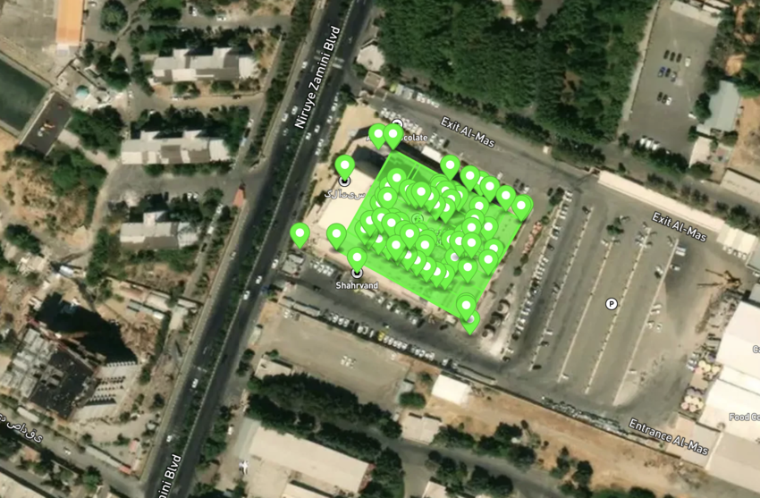
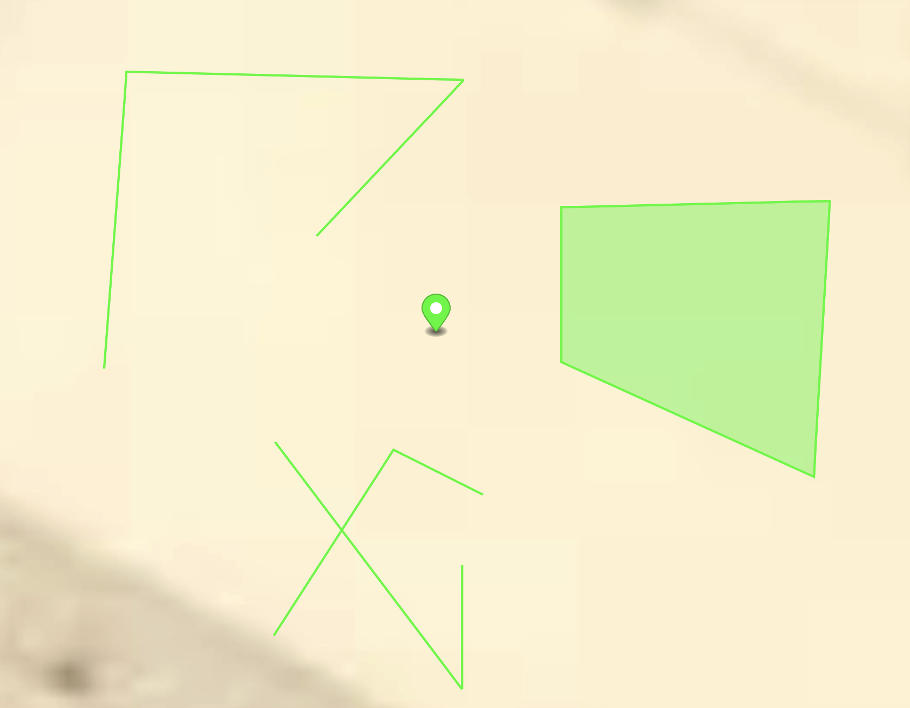
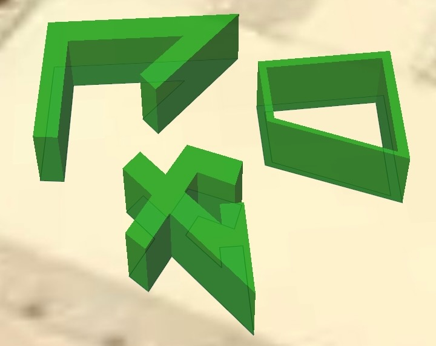

# GeoJSON tools

Quick GeoJSON tools for editing and modifying geojson data.

## Available Scripts

- [Features inside area](#features-inside-area)
- [Add polygons heights](#add-polygons-heights)
- [Rooms to walls](#rooms-to-walls)

### Features inside area

Removes any feature that is outside of a polygon. Great for grabbing an area indoor data generated by other services.




```
python3 features-inside-area.py
```

### Add polygons heights

Adds multiple properties to polygons: `level`, `height`, `base_height` and a random `color`.

```
python3 add-polygon-heights.py
```

## Rooms to walls

Create walls for any polygon room. You can adjust the wall thickness with `zeta`. It also sets `height` so walls are differentiable from the original room polygon.





```
python3 rooms-to-walls.py
```

## Contributing

Pull requests are welcome.