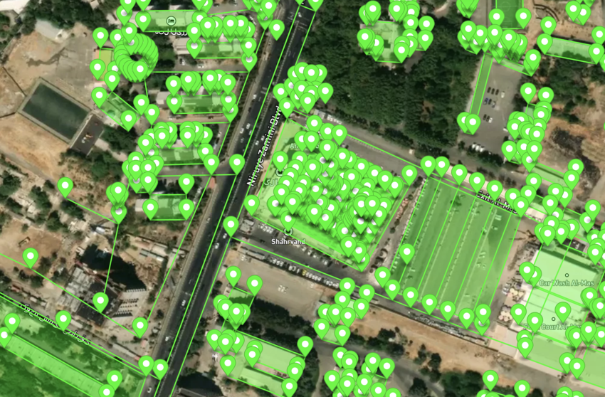

# GeoJSON tools

Quick GeoJSON tools for editing and modifying geojson data.

## Available Scripts

- [Features inside area](#features-inside-area)
- [Add polygons heights](#add-polygons-heights)
- [Rooms to walls](#rooms-to-walls)
- [Add doors to rooms](#add-doors-to-rooms)

### Features inside area

Removes any feature that is outside of a polygon. Great for grabbing an area indoor data generated by other services.




```
python3 features-inside-area.py
```

### Add polygons heights

Adds multiple properties to polygons: `level`, `height`, `base_height` and a random `color`.

```
python3 add-polygon-heights.py
```

## Rooms to walls

Create walls for any polygon room. You can adjust the wall thickness with `zeta`. It also sets `height` so walls are differentiable from the original room polygon.


```
python3 rooms-to-walls.py
```

## Add doors to rooms

Cut out rooms doors from their polygons. Doors are geometrically `points` near their walls.


Important notes:

* For assigning a door to a room, the door should have `door: yes` tag and `room_id`:
  ```json
    {
      "type": "Feature",
      "properties": {
        "room_id": "main",
        "tags": {
          "door": "yes"
        }
      },
      "geometry": {
        "coordinates": [~],
        "type": "Point"
      }
    }
    ```
    The room must have an `id` and a `room` indoor tag:
  ```json
    {
      "type": "Feature",
      "properties": {
        "id": "main",
        "tags": {
          "indoor": "room"
        }
      },
      "geometry": {
        "coordinates": [
          [~]
        ],
        "type": "Polygon"
       }
    }
  ```
* Door points must be near their wall but not necessarily on the wall line. The algorithm will find the nearest wall.
* Multiple doors for a single wall is NOT supported.
* Set `include_lintel` to `True` if you want the lintels to be included in the final feature collection. You can adjust their properties with `lintel_properties`.
* `circle_radius_cm` indirectly defines the width of the doors. Setting it to a big number will cause problems in finding the correct wall for a door.

```
python3 add-doors-to-rooms.py
```

## Contributing

Pull requests are welcome.